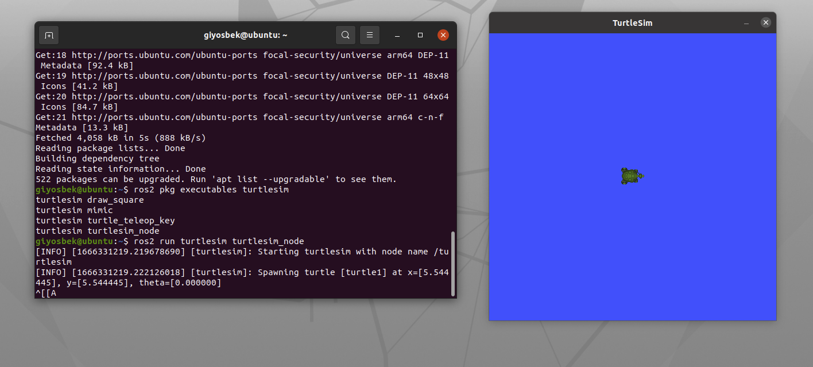

# Week4
## Turtlesim installation

### Install the turtlesim library
```
sudo apt update

sudo apt install ros-foxy-turtlesim
```
### To start turtlesim type the folllowing:
```
ros2 run turtlesim turtlesim_node
```
### You will see simulator window like this:

